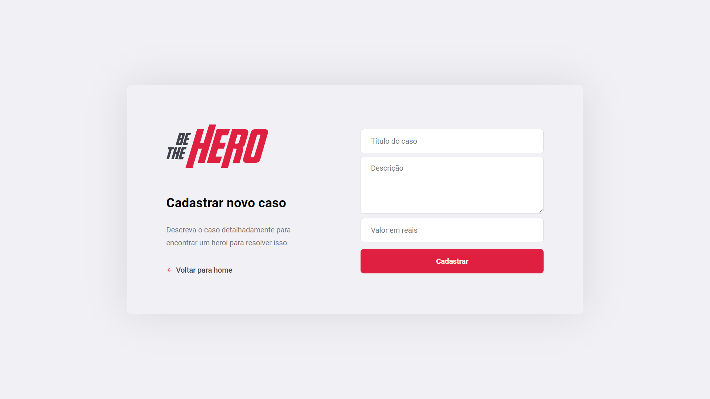

# Semana Omnistack 11.0

Foi desenvolvido o back-end e o front-end de uma aplicação web e mobile utilizando Node.js, ReactJS e React Native. 

A aplicação em questão se chama “Be The Hero”, onde é possível ajudar ONGs com doações financeiras atravésde casos que são cadastrados pela aplicação web, e pela aplicação mobile é possível entrar em contato com a ONG responsável pelo caso e realizar uma doação. 

A parte de baco de dados foi feita utilizando SQLite e o query builder Knex.js, que permite escrever a query em JavaScript. A conexão com o backend foi feita através do cliente HTTP Axios. 

## Aplicação Web:

Nesta tela inicial, as ONGs podem logar com a sua ID, caso elas não tenham cadastro, basta clicar em “Não tenho cadastro” que elas serão levadas a página de cadastro:

Nesta tela, as ONGs podem se cadastrar com suas informações de contato. Feito o cadastro, após o login é possível acessar a tela principal com os casos cadastrados da ONG:

Ao clicar em “Cadastrar novo caso”, o usuário é levado a seguinte tela:

## Aplicação Mobile:

Ao entrar no aplicativo mobile, é possível ver uma tela com todos os casos disponíveis para serem ajudados:

 | 

Ao abrir um caso, é possível entrar em contato com a ONG através de WhatsApp ou E-mail:

Através de deep linking, é possível abrir o WhatsApp ou Email através da aplicação mobile desenvolvida.

## Para executar o projeto:

**1) Primeiro passo: rodar o servidor backend**

Primeiramente é preciso ter o Node.js instalado. Navegue até a pasta do backend pelo terminal e execute o comando `npm install` para instalar todas as dependências necessárias. Para rodar o servidor backend, simplesmente rode o comando `npm start`, que ele automaticamente inicia o nodemon, que é um programa que automaticamente reinicia o servidor caso algum código tenha sido alterado.

**2) Segundo passo: rodar a frontend em React**

Navegue até a pasta frontend pelo terminal e execute o comando `npm install` para instalar todas as dependências. Depois rode o script start com o comando `npm start` que o frontend será inicializado.

**3) Terceiro passo: rodar a aplicação mobile**

Será necessário instalar o Expo na máquina através do comando `npm install -g expo-cli` (o ‘`-g`’ faz com que o pacote seja instalado de forma global na máquina). Caso haja algum problema, veja: [Solução de Problemas do Expo](expo-common-issues-master.md). Um problema que aconteceu comigo e a solução foi retirada do link mostrado anteriormente:

### **UnauthorizedAccess on run Expo command on Microsoft PowerShell**

- Caso esteja tentando executar `expo -h` através do Microsoft PowerShell e a mensagem de erro apresentada seja
  > expo : O arquivo C:\USUARIO\AppData\Roaming\npm\expo.ps1 não pode ser carregado porque a execução de scripts foi desabilitada neste sistema. Para obter mais informações, consulte about_Execution_Policies em https://go.microsoft.com/fwlink/?LinkID=135170.
  > No linha:1 caractere:1

> `+` expo -h   > `+ ~~~~`   > `+` CategoryInfo : ErrodeSegurança: (:) [], PSSecurityException   > `+` FullyQualifiedErrorId : UnauthorizedAccess  

- Seguir os seguintes passos:
(Executar como administrador o PowerShell)
1. No Microsoft PowerShell digitar `Get-ExecutionPolicy`. Irá aparecer <i>Restricted</i>
2. Em seguida, digitar `Set-ExecutionPolicy Unrestricted`, apertar enter e digitar S para aceitar a alteração da política de execução
3. Após feitos os passos anteriores, se digitar `Get-ExecutionPolicy` novamente, o terminal deverá mostrar <i>Unrestricted</i>

- Feito os passos anteriores, seu PowerShell estará habilitado para executar comandos Expo.

Navegue até a pasta movile pelo terminal e execute o comando `npm install` para instalar todas as dependências. Será necessário instalar também o Yarn através do comando `npm install -g yarn`. Em seguida rode o comando yarn start. Será aberta uma página no navegador e no canto inferior direito aparecerá um querry code que mais tarde será escaneado pelo celular.

Será necessário baixar e instalar o aplicativo Expo no celular:

Abra o aplicativo do Expo e escaneie o querry code.

É importante navegar para a pasta `mobile/src/services` e abrir o arquivo `api.js`. Na url que estiver aparecendo no código, substitua pela URL que apareceu na página no navegador logo depois de rodar o comando yarn start.

Caso enfrente problemas, pode ser necessário adaptar as dependências para versões mais atualizadas (`mobile/package.json`, `mobile/app.json`). A conexão LAN pode ser problemática também, caso seja necessário, mude para a conexão Tunnel.

